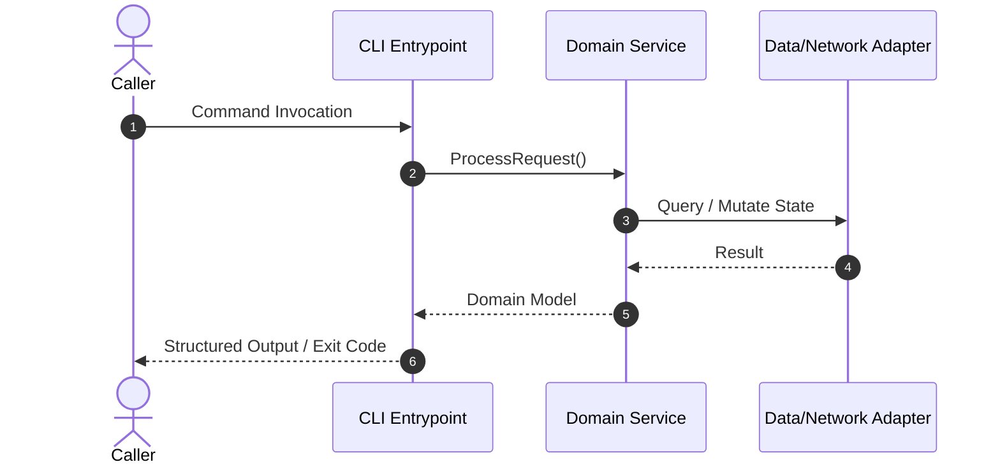

# Investigation Methodology

Before modifying any code, you must strictly follow these steps to organize facts and prevent assumption-based changes.

## 1. Gather Facts
- Extract only observable "facts" such as logs, error messages, and the current implementation code.
- Review related peripheral code and dependencies.

## 2. Separate Hypotheses
- Formulate hypotheses ("it might be working this way") based on the gathered facts.
- **Clearly distinguish between facts and hypotheses** when recording your findings.

## 3. Identify Unknowns
- List what is still unknown (uncertainties) that must be clarified before proceeding with implementation.
- Do not proceed with implementation blindly without doing this.

## 4. Visual Modeling with Mermaid Diagrams

To reduce human cognitive load and align mental models before writing code, formulate visual diagrams using Mermaid.js:

### A. Dynamic Call / Data Flow (Sequence Diagram)
Trace runtime calls from entrypoint down through domain services to adapters:

### B. Component Dependency & Blast Radius (Flowchart / DAG)
Visualize modules affected by the proposed change, enforcing unidirectional boundaries (`CLI → Domain → Adapters`):

```mermaid
graph TD
  CLI["CLI Entrypoint (cli/app.go)"] --> Domain["Domain Service (domain/service.go)"]
  Domain --> Repo["Repository Adapter (adapter/db.go)"]
  Domain --> Client["External Client (adapter/http.go)"]
  
  style CLI fill:#1e293b,stroke:#38bdf8,stroke-width:2px
  style Domain fill:#1e293b,stroke:#c084fc,stroke-width:2px
  style Repo fill:#1e293b,stroke:#f87171,stroke-width:2px
```

---

## 5. Evidence Binding & Fact Attribution

Map every component in the Mermaid diagram to verified source evidence:
- **Identifier**: Node or participant name (e.g., `Domain`, `Repo`).
- **Source Location**: Exact file path and line numbers (e.g., `internal/domain/service.go:L52-L98`).
- **Code Snippet**: The minimal relevant code lines establishing the fact.
- **Observed Fact**: Proven, observed behavior from static analysis or logs.
- **Hypothesis & Unknowns**: Assumptions that still require validation during the tracer phase.
- **Classification**: `FACT` (green), `HYPOTHESIS` (yellow), or `BLAST RADIUS` (red).

---

## 6. Canvas-Native Mermaid Artifact Output

At the conclusion of an investigation:
1. Deliver the findings directly as a Markdown Artifact (e.g., `investigation_<topic>.md` in `<appDataDir>/brain/<conversation-id>/` or `reports/investigation.md`).
2. Embed the validated Mermaid diagrams (`sequenceDiagram` and `graph TD`) directly into markdown code blocks. Gemini Canvas natively renders them with vector scaling, panning, and theme styling.
3. Structure the artifact so that diagram components are directly followed by their evidence sections (clickable file links, line ranges, minimal code snippets, verified facts, and hypotheses).
4. No custom HTML compilation is required, keeping the development loop lightweight, portable, and free of external browser/CDN dependencies.

---

## 7. Maintenance Heuristics

Depending on the investigation mode, apply these specific techniques:

### Impact Analysis (Impact Scoping)
- **Dependency Crawl**: Identify all modules that depend on the component being changed.
- **Blast Radius Mapping**: List indirect side effects (e.g., shared DB state, secondary events).
- **Contract Impact**: Check if the change alters CLI inputs/outputs or public API signatures.

### Root Cause Analysis (Bug Investigation)
- **5 Whys**: Drill down into the technical cause until the systemic failure point is found.
- **Fact Correlation**: Correlate logs, error messages, and state transitions to build a timeline of the failure.
- **Reproduction Case**: Define the minimal steps or test cases required to reliably reproduce the issue.

### Security & Vulnerability Assessment
- **Untrusted Input Flow**: Trace data from external entry points (CLI, UI, API) to sensitive sinks (DB, shell, filesystem).
- **Sensitive Data Handling**: Search for hardcoded secrets, unencrypted logs, or insecure storage.

---

## 8. Decide Next Action (Scoping the Tracer)
- Decide the "next place to look" or "what to try next" in order to clarify the unknowns or prove a hypothesis.
- For bugs, this usually means creating a failing test.
- For impact analysis, it means drafting a minimal verification plan.

