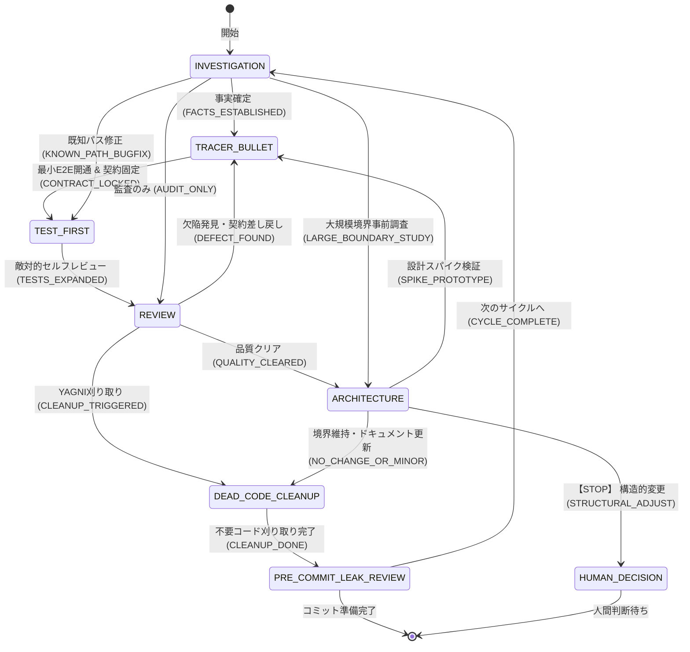

# Agentic Architecture Pattern: Portable Development Loop for Antigravity

## Core Principles

1. **Test is Specification**
   The source of truth lies in observable behavior, not in lengthy documentation.
2. **Start Small, Expand Later**
   Do not aim for a complete architecture from the start. Pass the minimal end-to-end path first, and only abstract or split when necessary.
3. **Tracer Bullet First**
   When facing uncertainty, build a "tracer bullet"—the minimal technical path that works—first, and run it locally.
4. **Investigate Before Modifying**
   Do not write code based on assumptions. Gather facts, separate hypotheses, and decide the next action first.

## Core 7 Skills & State Machine

Antigravity operates on **7 Core Skills** connected as an explicit execution state graph:

## Role-Specific Guidance: Antigravity 2.0 & Gemini 3.8+

Antigravity 2.0 equips the agent with first-class primitives: **Artifacts**, **Subagents**, **Lifecycle Hooks**, and **Terminal Sandboxing**. Gemini provides a vast context window, fast reasoning, and multimodal understanding. To maximize quality:

- **Artifact-Driven Outputs**:
  - Never dump massive reports, complete files, or raw test ledgers directly into the conversation chat.
  - Deliver plans, mission summaries, and reviews as **Artifacts** (`write_to_file` into the artifact directory) so the human can review them directly in the Canvas panel without polluting conversation context.
- **Executable Diagrams & Canvas Review**:
  - In `TRACER_BULLET` (contract locking) and `INVESTIGATION`, formulate Mermaid.js sequence or DAG diagrams directly inside Markdown Artifacts. Bind each path/node to a Scenario ID (e.g., `SCN-001-HAPPY-PATH`) or Component Identifier.
  - Review diagrams natively in Gemini Canvas without generating standalone HTML files, keeping the workflow clean and zero-overhead.
- **Execution Mode Profiles (Human-Controllable Lever)**:
  - **`ECONOMY` (Single-Agent Only)**: When the user requests token savings (`トークン節約モード`, `シングルエージェントで`), suppress subagents entirely. Execute all nodes sequentially on the primary agent to minimize cost and latency.
  - **`BALANCED` (Default Hybrid)**: Keep implementation (`TEST_FIRST`, `DEAD_CODE`, `PRE_COMMIT`) single-agent. Spawn subagents conditionally during `INVESTIGATION` or `REVIEW` if high uncertainty warrants multi-angle exploration.
  - **`DEEP_PARALLEL` (Full Multi-Agent)**: When requested (`並行探索モード`, `Spikeコンペ`), unleash parallel investigation, competitive tracer spikes, and multi-specialist review.
- **Subagent Parallelism & Safe Isolation Playbook**:
  - **Isolated Workspaces**: Always use `Workspace: "branch"` when spawning subagents for tracer spikes or code evaluation. Never permit concurrent mutations on a shared (`inherit`) workspace.
  - **Competitive Tracer Spikes**: In `TRACER_BULLET`, spawn competing technical approaches across separate branch workspaces. Use `python3 tools/orchestrator/arbiter.py` to automatically select the winning implementation based on in-process contract test pass rate and minimal drift.
  - **Reactive Aggregation**: Do not poll. Rely on reactive wakeups. Aggregate parallel findings into a unified Markdown Artifact on Canvas instead of flooding conversation context.

## Language Standards (Dual-First-Class: Go & Python)

- **Go**:
  - Structured logging with `log/slog` (no raw `fmt.Println` in production code).
  - Concurrency checks with `go test -race`.
  - In-process CLI contract testing via `app.Run(args, in, out)`.
  - Property-Based Testing with `rapid` or `testing/quick`.
- **Python**:
  - Structured logging with `structlog` or standard `logging` JSON formatter.
  - Concurrency checks with `pytest-asyncio` / unhandled task checks.
  - In-process CLI contract testing via Click `CliRunner` or `argparse` handlers.
  - Property-Based Testing with `hypothesis`.

## Architectural Guardrails

Architecture is not a "perfect blueprint" but a "minimal set of constraints to prevent excessive drift."

- **Preserve Observable Boundaries**: Define and lock the contract (CLI inputs/outputs, exit codes, error classifications) before implementation, and do not break it.
- **Dependency Direction**: Strictly adhere to unidirectional dependencies: `CLI/UI → Domain → Adapters`.
- **No Cyclic Dependencies**: Do not create circular references between modules.
- **Minimal Boundaries**: Keep the structure simple; do not prematurely split into components until the scope demands it.

## Drift Classification

Every change must be evaluated and classified into one of three categories:

| Classification | State | Action |
|---|---|---|
| **NO_CHANGE** | Fits completely within existing ADRs, boundaries, contracts, and dependency rules. | Proceed as is. |
| **MINOR_UPDATE** | Direction is valid, but requires minor documentation updates, compatible CLI flag additions, or code cleanup. | Clean up and proceed. |
| **STRUCTURAL_ADJUST** | Cannot be explained by existing guardrails. Breaks a boundary, responsibility, or public contract. | **[STOP]** Immediately halt the implementation and propose an Architecture Decision Record (ADR) and evolution plan to the human. |

## Safety Restrictions

The following destructive actions are strictly prohibited without explicit human confirmation:
- Mass file deletion
- Widespread filesystem rewrites
- External side effects (e.g., executing structural changes on live infrastructure)
