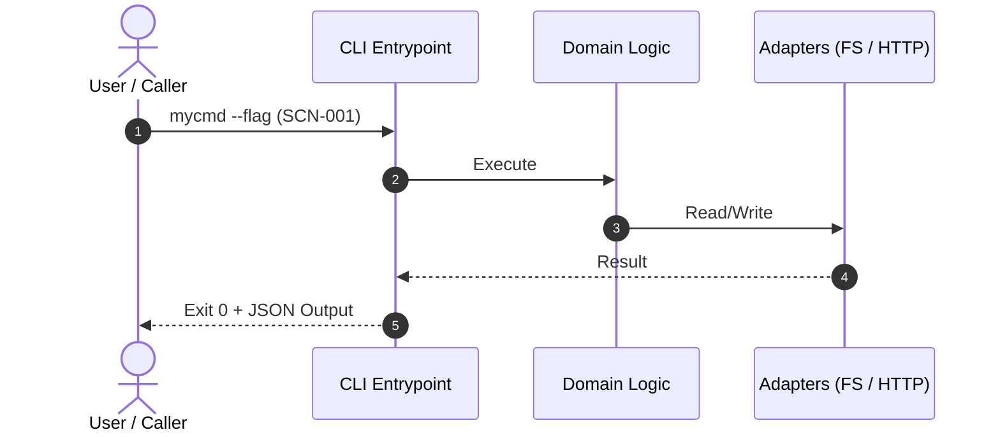

# /mission (Phase 1: Prove Viability)

This workflow is used to determine the direction of a new task and create the smallest technically viable code (tracer bullet).
**This command must STOP and wait for Human Inspection as soon as the tracer bullet behavior is verified.**

## Non-Functional Requirements (NFRs) Baseline

All implementations in this phase must adhere to the following standards:
- **Logging**: Use structured logging appropriate for the language/stack:
  - **Go**: `log/slog` (avoid `fmt.Println` for application logs).
  - **Python**: `structlog` or standard `logging` with JSON/structured formatter (avoid raw `print`).
- **Tracing**: Define observation points and spans using OpenTelemetry.

## Agent Execution Steps

1. **Investigation**
   - Investigate the current state of the relevant code and repository.
   - Organize known facts and identify uncertainties.
   - *(Required skill: `.antigravity/skills/investigation/SKILL.md`)*

2. **Fix the CLI Contract & Visual Diagram (Observable Specs)**
   - Define the target CLI inputs, expected outputs, exit codes, and error classifications using explicit typed models/schemas.
   - **Formulate Executable Mermaid Diagram**: Draft a sequence or flow diagram in Mermaid.js capturing the command invocation, adapter I/O, and outcome, tagging each execution path with a scenario ID (e.g., `SCN-001-HAPPY-PATH`, `SCN-002-INVALID-FLAG`).
   - Run provocation (Success-condition / Boundary / Omission error checks).
   - **Crucially, implement this contract as an in-process contract test (Tier A) and a minimal Tracer E2E test (Tier B).**
   - *(Required skill: `.antigravity/skills/cli-contract/SKILL.md`)*

3. **Implement and Verify the Tracer Bullet**
   - Write the "minimal working code" that connects from the CLI down to the bottom layer without premature abstraction or splitting.
   - Run the contract and tracer tests locally to ensure the code behaves exactly according to the CLI contract.
   - *(Required skill: `.antigravity/skills/tracer-bullet/SKILL.md`)*

4. **Output Plan and Stop**
   - Output the artifact using the `mission.md` format below (or write to an Artifact in platforms like Antigravity), include the human-in-the-loop Contract Review block and Mermaid diagram, and **STOP** working.

---

## Output Format (`mission.md`)

```markdown
# Mission
[Brief objective of the task]

# Context / Current State
[Current specifications and facts discovered during investigation]

# Visual Contract (Mermaid Diagram)


# CLI Contract
[The fixed CLI inputs, outputs, exit codes, and error classifications]

# Tracer Bullet Result
[Location of the minimal implementation and the proof of success when executed (e.g., terminal output)]

# Next Steps for /expand
[Guidelines for extending coverage, edge cases, PBT invariants, and refactoring using TDD in the next phase]
```
