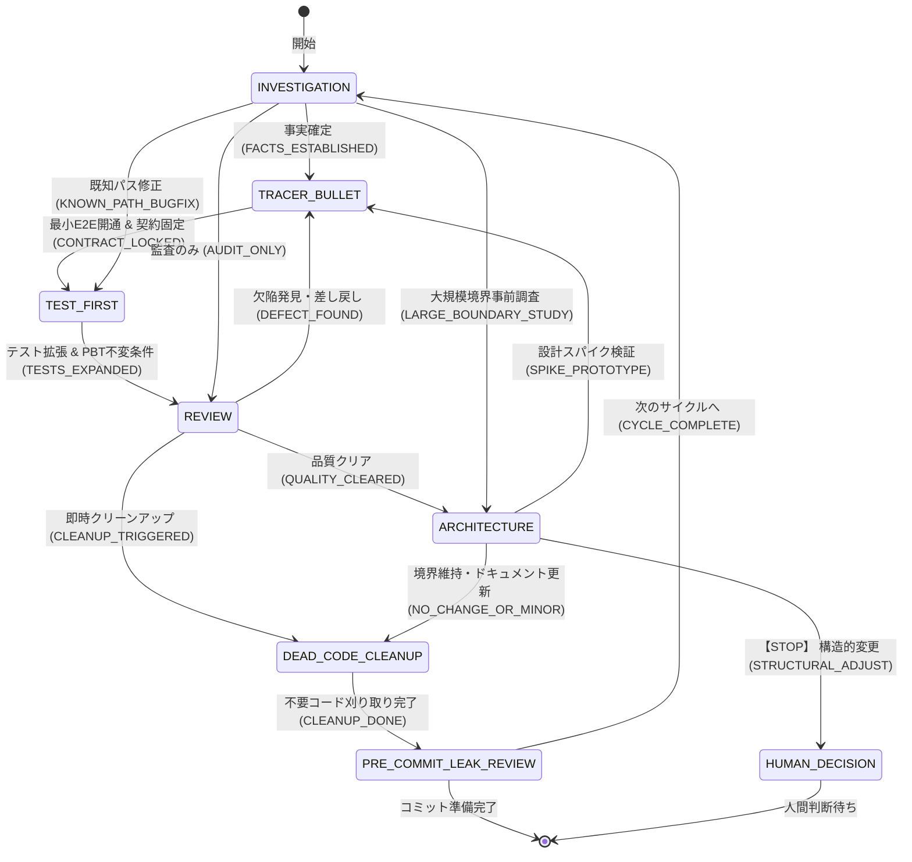

# Agentic Architecture Pattern: Portable Development Loop

## Core Principles

1. **Test is Specification**
   The source of truth lies in observable behavior, not in lengthy documentation.
2. **Start Small, Expand Later**
   Do not aim for a complete architecture from the start. Pass the minimal end-to-end path first, and only abstract or split when necessary.
3. **Tracer Bullet First**
   When facing uncertainty, build a "tracer bullet"—the minimal technical path that works—first, and run it locally.
4. **Investigate Before Modifying**
   Do not write code based on assumptions. Gather facts, separate hypotheses, and decide the next action first.

## Role-Specific Guidance: Codex

Codex excels in **detailed implementation, rigorous logic verification, test-first expansion, and post-implementation cleanups**. However, to prevent local optimization and context loss, Codex must adhere to the following role-specific constraints:

- **Maximize Strengths (Precision & Implementation)**:
  - Lead execution during the `TRACER_BULLET` (Tracer Bullet) and `TEST_FIRST` (Test-First Expansion) states.
  - Drive code optimization, test coverage hardening, and dead-code removal (`dead-code-cleanup`).
- **Mitigate Weaknesses (Context Loss & Boundary Drift)**:
  - Before writing code, always perform an `INVESTIGATION` step to verify project-wide boundaries and dependency directions.
  - Never breach established CLI/API contracts. If a local change risks causing architectural drift (`STRUCTURAL_ADJUST`), immediately halt and escalate to `HUMAN_DECISION`.

## Codex Workflow Sources

For Codex, the canonical workflow source is:

1. **`AGENTS.md`**
   Persistent project policy, boundaries, and task-routing guidance.
2. **`skills/`**
   Reusable execution playbooks for investigation, tracer bullets, test-first expansion, CLI contracts, review, planning, and architecture governance.
3. **`report-contract/`**
   The tracked contract and samples for workflow records, defining what may be written locally without committing runtime logs.
4. **`agents/`**
   Optional role presets that bind a focused responsibility to one or more skills.

## Codex Distribution Tiers

The minimal portable `.codex` core is:

1. **`AGENTS.md`**
2. **`skills/`**
3. **`report-contract/`**

This core intentionally avoids model pins, multi-agent runtime settings, and prompt-surfacing assumptions so it remains resilient to Codex CLI and model changes.

Additional optional layers are:

- **`agents/`** for role presets and tool-specific execution hints

## Core 7 Skills & State Machine

Codex operates on **7 Core Skills** connected as an explicit execution state graph:



### Skill Routing Table

Use the following 7 skills by default:

- **1. Investigation / Research / Impact Analysis** → `skills/investigation/SKILL.md`
- **2. Minimal viable end-to-end implementation & contract locking** → `skills/tracer-bullet/SKILL.md`
- **3. Expanding coverage and hardening invariants (PBT)** → `skills/test-first/SKILL.md`
- **4. Heuristic review for architecture, security, and maintainability** → `skills/review/SKILL.md`
- **5. Architecture drift checks and ADR decisions** → `skills/architecture/SKILL.md`
- **6. Post-implementation code reduction and dead-code removal** → `skills/dead-code-cleanup/SKILL.md`
- **7. Pre-commit leak / privacy / secret exposure review** → `skills/pre-commit-leak-review/SKILL.md`

## Adaptive Workflow Policy

Codex must navigate the state graph based on task maturity:

- `INVESTIGATION`: Gather facts, separate hypotheses, declare unknowns before modifying.
- `TRACER_BULLET`: Lock the observable contract (CLI/API boundary) and prove the minimal happy path locally.
- `TEST_FIRST`: Expand coverage via GWT scenarios and enforce invariants using Property-Based Testing (PBT).
- `REVIEW`: Evaluate cross-module impact, security, performance, and code quality.
- `ARCHITECTURE`: Classify architectural changes into `NO_CHANGE`, `MINOR_UPDATE`, or `STRUCTURAL_ADJUST`.
- `DEAD_CODE_CLEANUP`: Post-implementation code reduction and dead-code removal.
- `PRE_COMMIT_LEAK_REVIEW`: Review staged git changes for secrets and personal disclosures.
- `HUMAN_DECISION`: [STOP] when `STRUCTURAL_ADJUST` occurs or when public boundaries change.

### Tracer-before-Test-First Rule

Codex must prefer `TRACER_BULLET` before `TEST_FIRST` when any of the following are true:

- A new execution path is being introduced
- A new adapter or external integration is being added
- The observable contract is not yet fixed
- The implementation approach is still uncertain
- The blast radius is unclear

Codex may start with `TEST_FIRST` or direct implementation when all of the following are true:

- The existing execution path already works
- The change is local and well understood
- The contract is unchanged or already protected
- The work is primarily a bug fix, narrow refactor, or pure test addition

When the `Tracer-before-Test-First Rule` says `TRACER_BULLET`, Codex must not jump directly into broad test-first expansion.

### Flexible Insertion Rules

Codex may insert `INVESTIGATION`, `REVIEW`, or `ARCHITECTURE` between implementation steps when needed.

- Re-enter `INVESTIGATION` when new uncertainty appears
- Return to `TRACER_BULLET` when provocation reveals an unresolved contract concern
- Insert `REVIEW` when implementation has accumulated enough risk or surface area
- Insert `ARCHITECTURE` when architectural boundaries, public contracts, or technology choices may have changed
- Move to `HUMAN_DECISION` when the unresolved concern is about product meaning, public boundary semantics, or responsibility boundaries rather than code mechanics

### Review and Drift Triggers

Queue a `REVIEW` recommendation when any of the following are true:

- The implementation has grown across multiple files or modules
- A tracer bullet has been expanded beyond the happy path
- Performance, security, or maintainability concerns are visible
- The implementation works but now contains dead code, duplicate logic, or cleanup opportunities
- Temporary implied ADR notes exist
- The user asks for hardening, cleanup, or broader confidence

Queue an `ARCHITECTURE` recommendation when any of the following are true:

- Dependency direction has changed
- Responsibilities moved across boundaries
- Public CLI or API contracts changed
- New technology or infrastructure choices were introduced
- New wiring crosses architectural boundaries

If the likely result is `STRUCTURAL_ADJUST`, stop autonomous evolution and move to `HUMAN_DECISION`.

### Next Action Contract

At major checkpoints, Codex must present a concise `次のステップ:` section containing:
1. **推奨アクション**: メインパスの次のステップ（状態遷移グラフの次のノード）
2. **代替アクション**: スコープ調整や別アプローチ
3. **検証アクション**: `Verify:` で実行可能なコマンド例

## Record-Only Observability

Use `.codex/report-contract/` as the tracked contract and `.codex/reports/` as the local runtime output directory.

- `run-log.jsonl`: Task-level facts and overall outcomes
- `planner-checkpoints.jsonl`: Major checkpoint recommendations
- `verification-ledger.jsonl`: `Verify:` command results
- `human-decisions.jsonl`: Human approvals, stops, and rationale

These artifacts must remain **record-only**:

- Allowed: tracked samples and schemas under `.codex/report-contract/`, plus append-only local records under `.codex/reports/`
- Not allowed: log-driven routing, automatic retries, approval enforcement, or any other runtime control loop
- Do not commit real runtime logs under `.codex/reports/`

## Architectural Guardrails

Architecture is not a "perfect blueprint" but a "minimal set of constraints to prevent excessive drift."

- **Preserve Observable Boundaries**: Define and lock the contract (CLI inputs/outputs, exit codes, error classifications) before implementation, and do not break it.
- **Dependency Direction**: Strictly adhere to unidirectional dependencies: `CLI/UI → Domain → Adapters`.
- **No Cyclic Dependencies**: Do not create circular references between modules.
- **Minimal Boundaries**: Keep the structure simple; do not prematurely split into components until the scope demands it.

## Drift Classification

Every change must be evaluated and classified into one of three categories:

| Classification | State | Action |
|---|---|---|
| **NO_CHANGE** | Fits completely within existing ADRs, boundaries, contracts, and dependency rules. | Proceed as is. |
| **MINOR_UPDATE** | Direction is valid, but requires minor documentation updates or code cleanup (e.g., clarifying responsibility comments). | Clean up and proceed. |
| **STRUCTURAL_ADJUST** | Cannot be explained by existing guardrails. Breaks a boundary, responsibility, or contract. | **[STOP]** Immediately halt the implementation and propose an Architecture Decision Record (ADR) and evolution plan to the human. |

## Safety Restrictions

The following destructive actions are strictly prohibited without explicit human confirmation:
- Mass file deletion
- Widespread filesystem rewrites
- External side effects (e.g., executing structural changes on live infrastructure)

## Loop Governance & Self-Correction

To practice robust Loop Engineering and ensure reliable autonomous execution, the agent must adhere to the following execution loop rules:

### 1. Autonomous Retry Loop
When a command, test, or build fails, the agent must not immediately halt or prompt the user for help. Instead, it must autonomously initiate a self-correction loop:
1. **Analyze**: Inspect the error logs, trace output, and recent code changes.
2. **Hypothesize**: Formulate a clear hypothesis about the root cause of the failure.
3. **Execute & Verify**: Implement the corrected logic and re-run the verification command.

### 2. Infinite Loop & Stalling Prevention
To prevent resource waste and infinite looping:
- If the self-correction loop fails to resolve the issue after **3 attempts** (or if the implementation results in the same recurring error), the agent must halt autonomous execution.
- Route the task to `HUMAN_DECISION` and present a structured summary using the following **Escalation Summary Format** (ensure all API keys, credentials, and private paths are sanitized/masked before presenting):
  ```markdown
  ### Loop Halt: [Short reason for stall]
  - **Goal**: [What the loop was trying to achieve]
  - **Failed Attempts**: [Brief list of what was tried and failed (e.g., Command X failed with Error Y)]
  - **Tested Hypotheses**: [What hypotheses were disproven]
  - **Proposed Options**:
    1. [Option A - recommended adjustment]
    2. [Option B - alternative]
  ```
