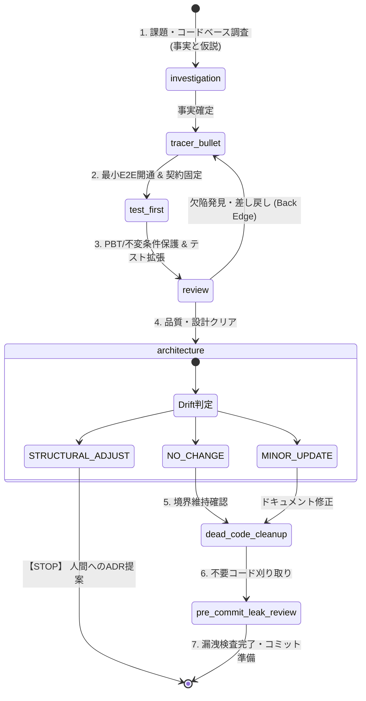

# Principles & Workflows for Autonomous Coding Agents

This repository provides the core **principles, architectural guardrails, workflows, and skills** necessary to safely and effectively introduce autonomous coding agents into a software project.

Rather than letting AI agents guess implementation details or make speculative architectural decisions, these configurations enforce a strict, test-driven development loop. They ensure that agents investigate before modifying, establish automated CLI test contracts, and seek human approval before enacting structural changes.

## Supported Agents

We provide tailored instructions and skill definitions for the leading agent platforms:

- **`.agent`**: Generic / platform-independent rules and Core 7 skills. Compatible with CLI-based agent frameworks.
- **`.antigravity`**: Optimized for **Google Antigravity**. Restructures rules (`ANTIGRAVITY.md`, `GEMINI.md`), lifecycle hooks (`hooks.json`), and the Core 7 skills to serve as first-class primitives with Canvas-native Mermaid.js rendering.
- **`.codex`**: Optimized for **OpenAI Codex** (and similar IDE-based agents). Uses `AGENTS.md` as the canonical policy layer containing the formal state transition graph, `skills/` as reusable playbooks, `report-contract/` as the tracked runtime-record contract, and optional `agents/` presets.

## Core Concepts (The 7 Core Skills)

Agents are bound to an explicit execution graph composed of 7 essential skills:

1. **`investigation` (Investigation Methodology)**: Gather facts, separate hypotheses, and declare unknowns before modifying any code.
2. **`tracer-bullet` (Tracer Bullet & Contract Lock)**: Lock observable boundaries (CLI/API integration tests) first, then implement the minimal viable end-to-end path locally.
3. **`test-first` (Test-First Expansion)**: Expand coverage using Given/When/Then scenarios and harden invariants using Property-Based Testing (PBT).
4. **`review` (Code and Architecture Review)**: Multi-perspective heuristic review covering architectural boundaries, security, concurrency, and blast radius.
5. **`architecture` (Architecture Governance)**: Classify file and structural drift (`NO_CHANGE`, `MINOR_UPDATE`, `STRUCTURAL_ADJUST`). A `STRUCTURAL_ADJUST` immediately halts execution to propose an Architecture Decision Record (ADR).
6. **`dead-code-cleanup` (Dead Code Cleanup)**: Post-implementation cleanup to safely remove unused, duplicate, or overly verbose code once behavior is protected.
7. **`pre-commit-leak-review` (Pre-Commit Leak Review)**: Inspect staged files and diffs for secrets, API tokens, sensitive PII, and unintended data leaks before committing.

## Graph Engineering & State Machine

The portable development loop is modeled as a formal **State Transition Graph** embedded directly in `.codex/AGENTS.md` and `.antigravity/GEMINI.md`:



### Key Graph Properties
- **Back Edges**: When `review` uncovers functional flaws or performance regressions, execution explicitly routes back to `tracer_bullet` or `test_first` rather than applying ad-hoc patches.
- **Guardrail Halt (Terminal Stop)**: If `architecture` identifies a `STRUCTURAL_ADJUST`, the agent must immediately halt and escalate to `HUMAN_DECISION` with an ADR proposal.
- **Canvas-Native Visuals**: In Google Antigravity, diagrams are rendered natively via Gemini Canvas in Markdown artifacts without fragile browser/HTML dependencies.

## Installation

Use the included `Makefile` to install the configurations into your target project or global environment:

```bash
# Install generic .agent configs (Core 7 skills)
make install DEST=/path/to/your/project

# Install Antigravity (.antigravity) configs to a project
make install-antigravity DEST=/path/to/your/project

# Install Antigravity configs globally to Home (~/.gemini/config and ~/.gemini/antigravity-cli)
make install-home-antigravity

# Install Codex (.codex) configs to a project
make install-codex DEST=/path/to/your/project

# Install Codex core config to ~/.codex (AGENTS.md + Core 7 skills + report-contract)
make install-home-codex-core

# Install Codex config to ~/.codex with agent presets
make install-home-codex

# Install Codex minimal config to ~/.codex
make install-home-codex-minimal
```

## Structure

- **`AGENTS.md` / `ANTIGRAVITY.md` / `GEMINI.md`**: Canonical entrypoints and guardrail policies.
- **`skills/`**: The Core 7 execution playbooks across `.codex`, `.antigravity`, and `.agent`.
- **`report-contract/`**: Tracked schemas, samples, and guardrails for runtime records (`.codex/report-contract/`).
- **`agents/`**: Focused Codex agent presets (`architect.toml`, `investigator.toml`, `tester.toml`, `tracer.toml`).
- **`tools/`**: In-process contract verification utilities (e.g. `cli_linter/lint_cli.py`).

## Codex Usage Model

For Codex, prefer the following order of authority:

1. **`AGENTS.md`** for persistent repo policy, state machine transitions, and task-routing guidance
2. **`skills/`** for reusable execution playbooks (Core 7)
3. **`report-contract/`** for tracked schemas, samples, and guardrails for runtime records
4. **`agents/`** for focused presets (investigator, tracer, tester, architect)

Recommended Codex distribution tiers:

- `core`: `AGENTS.md + skills + report-contract`
- `minimal`: `AGENTS.md + skills + report-contract + agents`
- `full`: `AGENTS.md + skills + report-contract + agents`

Recommended skill routing for Codex:

- **Investigation, debugging, impact analysis, and research** -> `investigation`
- **Minimal viable end-to-end path & Contract Lock** -> `tracer-bullet`
- **Coverage expansion and invariant protection (PBT)** -> `test-first`
- **Broad review, blast radius, and triage** -> `review`
- **Architecture drift checks and ADR decisions** -> `architecture`
- **Post-implementation code reduction and dead-code removal** -> `dead-code-cleanup`
- **Pre-commit leak / privacy / secret exposure review** -> `pre-commit-leak-review`

`dead-code-cleanup` is intentionally narrower than `review`: use `review` to surface broad quality and architectural risks, and use `dead-code-cleanup` when the main question is what can now be deleted, merged, inlined, or simplified without changing intended behavior.

`make install-home-codex-core` installs the long-lived portable core: `AGENTS.md + skills + report-contract`.

`make install-home-codex-minimal` and `make install-home-codex` install `AGENTS.md + skills + report-contract + agents`.

Use `.codex/report-contract/` for tracked samples and `.codex/reports/` for untracked runtime output. The files in `.codex/reports/` are **record-only**. They may store facts, verifications, recommendations, and human decisions, but they must not become inputs for automatic routing, retries, or approval enforcement.

## Post-Install Operator Notes

After distribution, next-step recommendations are standardized at major checkpoints using a numbered `次のステップ:` block:

- Mark only `1.` as recommended with `（推奨）`.
- When `1.` assumes code changes, add a short `Verify:` line with a local build, test, or command for the user.
- Keep `Verify:` to one command and one observation point so the user can run it without choosing among alternatives.
- When a follow-up can run independently in parallel, prefix that action with `（Async）`.
- Keep workflow state tokens explicit: `INVESTIGATE`, `CONTRACT_LOCK`, `TRACER`, `EXPAND`, `REVIEW`, `DRIFT_CHECK`, `HUMAN_DECISION`.
- Add `Current Read:` only when the current status is not already obvious.

Canonical format:

```markdown
Current Read: [short status if needed]

次のステップ:
1. （推奨）[WORKFLOW_STATE]: [short action]
   Verify: [one command + one observation point]
2. [WORKFLOW_STATE]: （Async）[short action]
3. [WORKFLOW_STATE]: [short action]
```

## Verification

Run the repository integration checks with:

```bash
make test
```

These checks verify that:

- Core 7 skills are synchronized and present across `.agent`, `.antigravity`, and `.codex`
- Obsolete skills (`cli-contract`, `planner`, `report-observability`) and legacy Claude files are completely removed
- The state transition graph in `AGENTS.md` and `GEMINI.md` remains intact
- CLI contracts, installation targets, and linter guardrails are fully enforced
